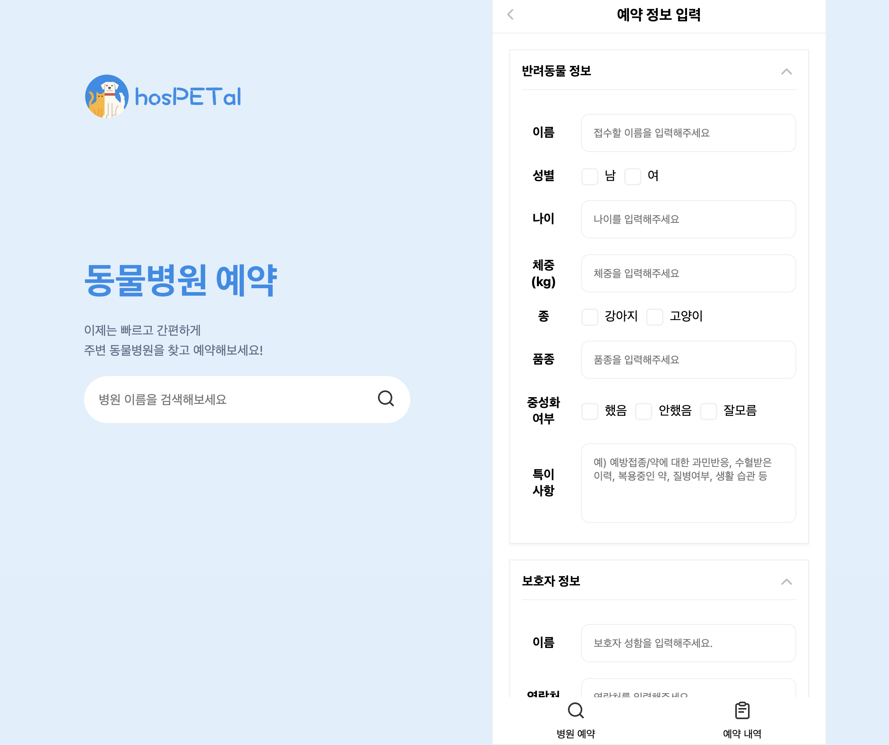

# 동물병원 예약 보호자 이용 서비스

## 사용 기술
|||
|---|---|
|언어|`TypeScript`
|라이브러리|`React`
|프레임워크|`Next.js` (v.12)
|상태관리|`React-Query`
|스타일링|`emotion`
|패키지 관리자|`yarn berry` (PnP(Zero-install))

<br/>


## 시작하기
* Mock API 요청 횟수 제한으로 인해 `json-server` 브랜치를 딴 후 json-server로 대체하였습니다. 
```bash
git checkout json-server
```
```bash
yarn dev
```

<br/>

## 기능
### 메인화면
- 현재 사용자의 위치 기반으로 지도 내에 주변 병원 위치 목록 확인 가능
- 병원 이름 검색 가능


<br/>

### 상세 페이지
- 마커 클릭 시 병원 상세페이지로 이동
- 현재 진료 여부 및 진료시간 확인 가능
- 병원 상세주소 클립보드에 복사
- 지도 내에 상세한 병원 위치 확인 가능


<br/>

### 예약 페이지
- UI/UX 구현





